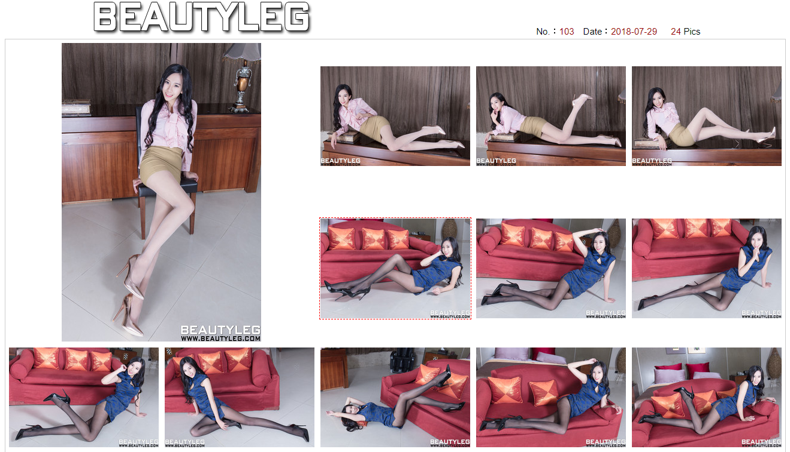
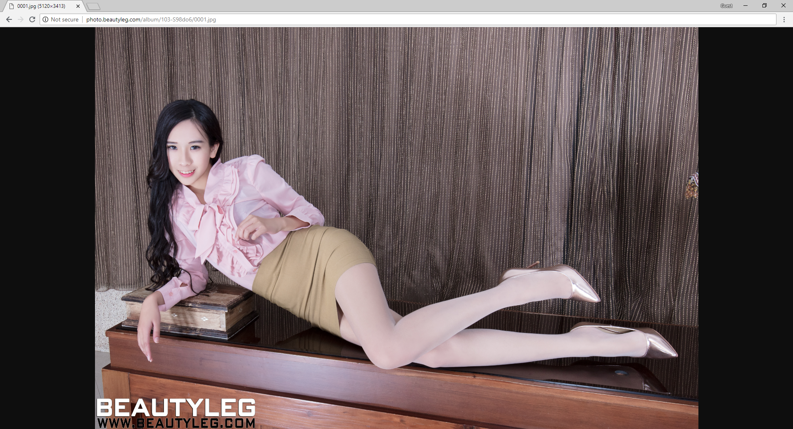
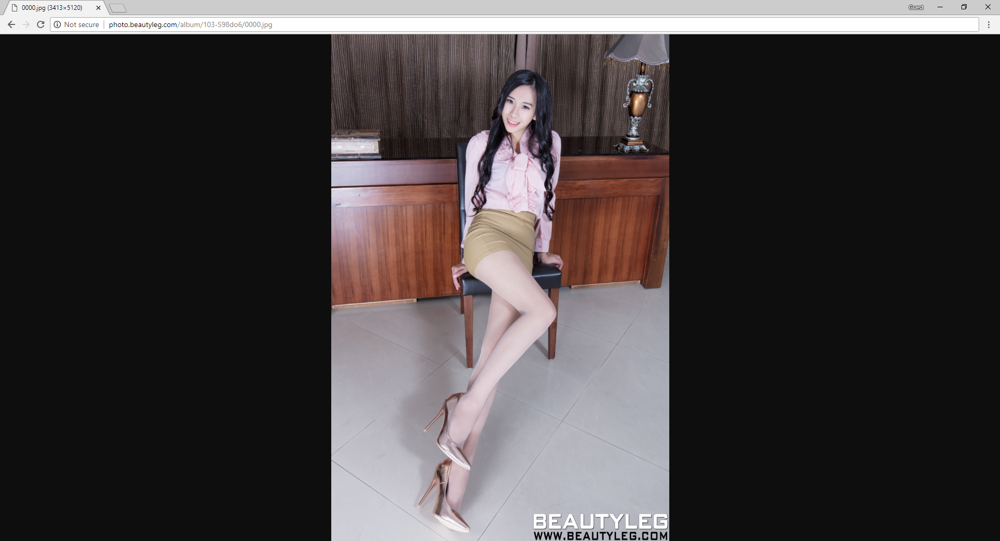
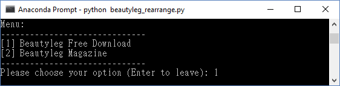
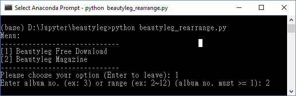
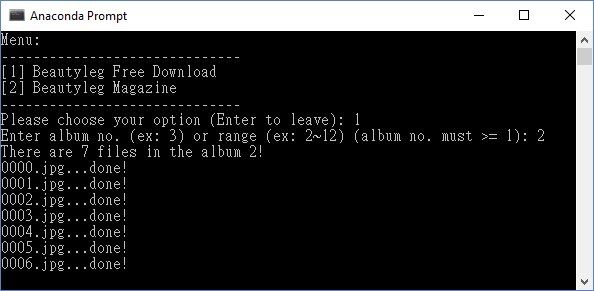
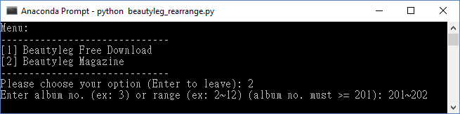
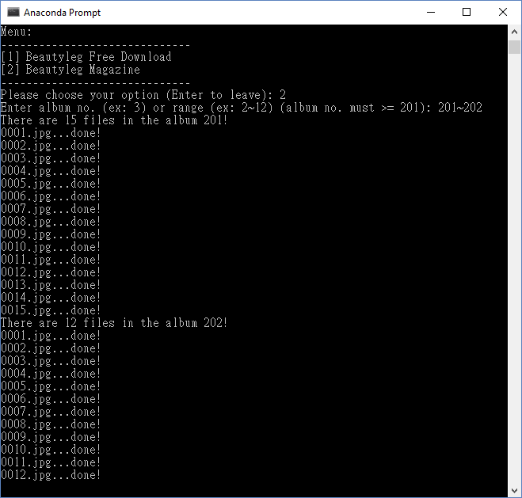
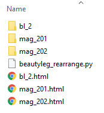

## 背景

身為一個美腿控，在 Beautyleg.com 賞圖是再愉快不過的事情了。我發現 Beautyleg.com 在設計上有許多改進的空間。所以我寫了這支程式，目的在增進用戶的視覺體驗！

### 圖片下載問題

在 Beautyleg.com 賞圖時，首先看到的是小圖，像這樣



接著你必須點擊小圖才能看到大圖，想看下一張圖，必須回上一頁重新點擊小圖，很不方便。解決辦法是用批次下載軟體將圖片下載到你的電腦欣賞。下載後可用 Windows 內建圖片瀏覽器看大圖，圖片載入是即時的，不需要等待圖片下載的時間。麻煩的是，批次下載軟體要另外安裝且設定，如果你已安裝 Python，本程式能讓你輕鬆下載 Beautyleg.com 圖片！

### 圖片切換問題

即便我們下載了圖片，仍有許多瀏覽上的不便。雖然我們可用左右鍵切換圖片，但既然是同一本相簿，為何不放在同一個頁面，省去左右切換的時間呢？本程式自動下載相簿後，會產生一個 html 檔，將所有圖片顯示在同一個頁面上，用滑鼠上下拖曳即可。

### 圖片縮放問題

Beautyleg.com 圖片解析度很高，原始尺寸也很大，不論你在瀏覽器上看或下載後看，預設的圖片顯示大小是切齊螢幕上下的，對水平圖片而言，左右兩邊留下了不必要的空白 (換言之，浪費了我們的寬螢幕)，對垂直圖片而言，圖片被縮得更小，左右兩邊留白更多。但當我們切換成實際尺寸，圖片又變得太大以至於影響視覺。

水平圖片預設大小如下，左右兩邊浪費了一些空間。



垂直圖片預設大小如下，左右兩邊浪費的空間更多。



但切換成實際大小，圖片又變得太大不好看。


本程式將圖片放到最大 (左右不留白)，隨著你的視窗大小而變。水平圖片以 100% 視窗大小顯示，垂直圖片則以 50% 視窗大小並排顯示，如下：

垂直圖片兩兩並排效果如下：


水平圖片效果如下：


本程式依水平、垂直方向對圖片分類，顯示時先秀出垂直圖片，再秀出水平圖片。

## 如何使用

本程式使用 `Python 3.6` 編寫，並呼叫 `Pillow` 和 `beautifulsoup4` 這兩個 library，可用 pip 安裝：
```
pip install Pillow beautifulsoup4
```

執行本程式
```
python beautyleg_rearrange.py
```

首先會先看到一個選單，可選擇下載 `免費下載 Free Download` (輸入 1) 或 `名模美腿 Vogue Photo` (輸入 2)：



假設我們選擇 `免費下載 Free Download`，接下來請輸入要下載的相簿編號，可以是單一相簿 (如 2) 或多個相簿 (如 2~12)。請注意相簿編號**從 1 開始到最新一本**。

> 最新一本編號請上[網站](http://beautyleg.com/)查看。



注意多個相簿的輸入方式是 `起始相簿~結束相簿`，中間必須是 `~` 符號，不可是其他符號。

這裡我們選擇下載`單一相簿` (輸入 2)，程式會告訴你相簿裡有幾張圖片 (7 張)，並且讓你知道下載的進度 (下載完成後會秀出 done!)：



若我們選擇 `名模美腿 Vogue Photo` (輸入 2)，同樣要輸入相簿編號，可以是單一相簿 (如 2) 或多個相簿 (如 2~12)。請注意相簿編號**從 201 開始到最新一本**。

> 最新一本相簿編號請上[網站](http://beautyleg.com/magazine/)查看。

這次我們選擇下載 `多個相簿` (輸入 201~202) 試試看：



程式會依序下載相簿，結果如下：



下載完成後，資料夾會出現圖片資料夾和 html 檔如下，點擊 html 檔，開始享受更棒的賞圖體驗！

